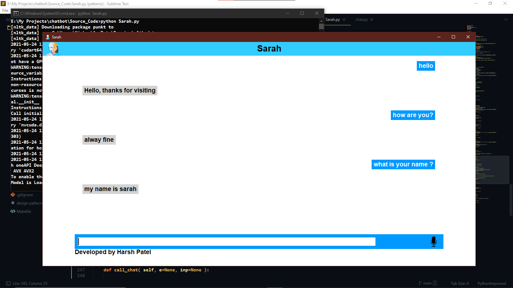

# Chatbot Sarah 
## Functionality 
- Text Chat with bot
- Voice recognition 
- Voice Response 

## How to use
### Train
- You can train chatbot with your custom data by puting your data into data\intents.json file with following format :
- {"tag":"Label",
 "pattern":["keywords of your question"],
 "responses":["expected responses"],
 "context_set": ""}
 - Delete model folder
 - Run "python Sarah.py" in terminal. It will start training.
 - To get voice response add tags in "data/speak.json".
 
 ## Snapshots 
 - Main Screen
 
